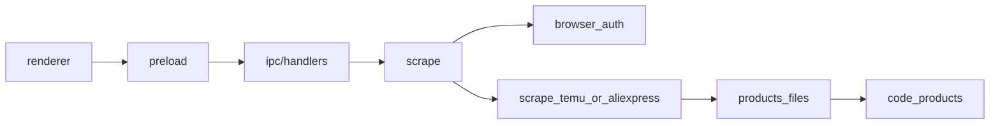

# Architecture

How to place code in this repo. Agents: read this whenever you add or move files.

## Processes

Electron three-process layout:

| Area | Path | Role |
|------|------|------|
| Main | `src/main/` | App lifecycle, IPC, Playwright, scrape, DB, disk |
| Preload | `src/preload/` | `contextBridge` → `window.api` |
| Renderer | `src/renderer/` | React UI |
| Shared contracts | `src/shared/types/` | Types used across main / preload / renderer |

## Main-process map

| Folder | Put here | Do not put here |
|--------|----------|-----------------|
| `src/main/app` | Window / app lifecycle | Business logic |
| `src/main/ipc` | Thin IPC handlers | Scraping / heavy SQL |
| `src/main/browser` | Playwright session, human gate | Marketplace DOM extractors |
| `src/main/browser/auth` | Per-marketplace login / captcha | Shared “smart” cross-platform auth |
| `src/main/scrape` | Orchestration + URL parse | DB upserts |
| `src/main/scrape/<platform>/` | Platform scrapers | Helpers that hide platform differences |
| `src/main/db` | Schema + row/payload types | Queries |
| `src/main/code` | SQLite read/write helpers | Playwright / disk I/O |
| `src/main/core` | Connect, paths, migrate | Domain features |
| `src/main/products` | List/get/update, gallery, on-disk product folders | Marketplace DOM scrape |
| `src/main/media` | `ml-media://` protocol | Product business rules |
| `src/main/jobs` | Job / download logging | Feature logic |

Do not invent a new top-level folder under `src/main/` unless it matches a real new concern. Prefer extending an existing folder.

## Import download flow

1. UI sends a product URL.
2. `parseProductUrl` identifies platform + product id (shared entry only).
3. Routers dispatch to platform modules (auth + scrape).
4. Platform code returns a scraped payload.
5. Catalog orchestration saves to disk (`products/`) and upserts SQLite (`code/`).

## Marketplace split (hard rule)

**Intentional early-stage policy:** Temu and AliExpress stay in separate code. Do not merge them “because they look similar.”

- After the URL/platform is known, **branch immediately**.
- Routers only dispatch — thin `if platform → call platform module`. No DOM, fetch, or marketplace business logic inside routers.
  - Examples: `src/main/browser/marketAuth.ts`, `src/main/scrape/product.ts`.
- Platform code lives in separate folders/files:
  - Auth: `src/main/browser/auth/{temu,aliexpress}.ts`
  - Scrape: `src/main/scrape/{temu,aliexpress}/…`
- Even if a chunk looks identical today (fetch, gallery walk, login helpers), **duplicate it** into the platform folder. Do not write a shared “fetch for both Temu and AliExpress.”
- High-level workflow may match (URL → auth → scrape → disk → DB); implementations differ and must stay separate.
- Keep structure **easy to refactor later**: short files, clear folder boundaries, mirrored module names per platform (e.g. both sides may have `gallery.ts`, `seller.ts`). Consolidation is deferred until the app settles — see [docs/features-later.md](docs/features-later.md).
- When adding AliExpress scrape: create `src/main/scrape/aliexpress/` (mirror Temu’s split). Do not put AliExpress logic into `scrape/temu/` or into shared scrape helpers.

Platform ids: `'temu' | 'aliexpress'`. Folders/files use lowercase (`temu/`, `aliexpress.ts`).

## Short files

- One concern / one step / one class-sized unit per file (Temu gallery ≠ Temu seller ≠ Temu buy-box).
- Soft guideline: if a file grows past ~200–250 lines or mixes unrelated steps, split by step or type.
- Keep IPC handlers thin; push work into `scrape` / `products` / `code`.

## Extra guidance (tighten later; do not block current work)

- Prefer keeping SQL in `code/`. `products/list` and `products/load` currently run some raw SELECTs — trend toward `code` helpers over time.
- Keep disk/catalog code platform-agnostic. New marketplace referers/hosts belong in that platform’s auth/scrape folder, not in generic `products/` helpers.
- IPC/API shapes → `src/shared/types`. Main-only DB shapes → `src/main/db/models`.
- Renderer stays platform-agnostic unless a screen truly needs marketplace-specific UI; then use a clear feature/platform folder, not scattered conditionals.

## Docs for agents

| File | Purpose |
|------|---------|
| [ARCHITECTURE.md](ARCHITECTURE.md) | Where code goes (this file) |
| [docs/bugs-to-fix.md](docs/bugs-to-fix.md) | Bug backlog |
| [docs/bugs-wont-fix.md](docs/bugs-wont-fix.md) | Bugs we will not fix |
| [docs/features-later.md](docs/features-later.md) | Future work (including Temu/AliExpress merge revisit) |
